# Interaction Design

### Hosted site: https://NunoSantos98.github.io/INTERACTION-DESIGN

#

# Introduction

---

This repository includes nine components offering design solutions to real-world problems. Only five designs have supported research, evaluation of guidelines, planning & design prototyping, coding, screencast, and final reflection. 

 All nine components can be access clicking on the link at the top.

 ---
---
# 1. Buttons
---
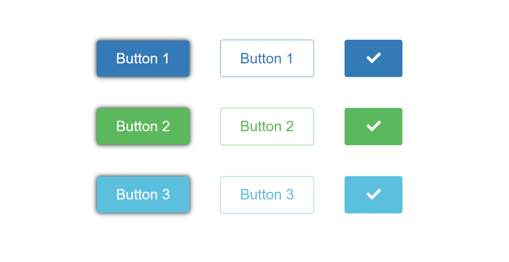

---
---
- ## 1.1 Research
---
Buttons encourage users to take action and make decisions with a single press. Buttons communicate the steps users can perform. They are usually located in the UI of your website, which should be easily searchable and recognizable, thus explicitly showing the activity that helps the user to complete.

“You press the button, we do the rest,” — Kodak cameras appealed to potential consumers, through a catchy and direct tagline.

The most popular are rectangular buttons with rounded corners, which are readily recognizable and look nice next to the input field. Choosing the right button design would depend on the intent, the medium, and the guidelines. As we can see the image bellow the exisiting parameters to design a button

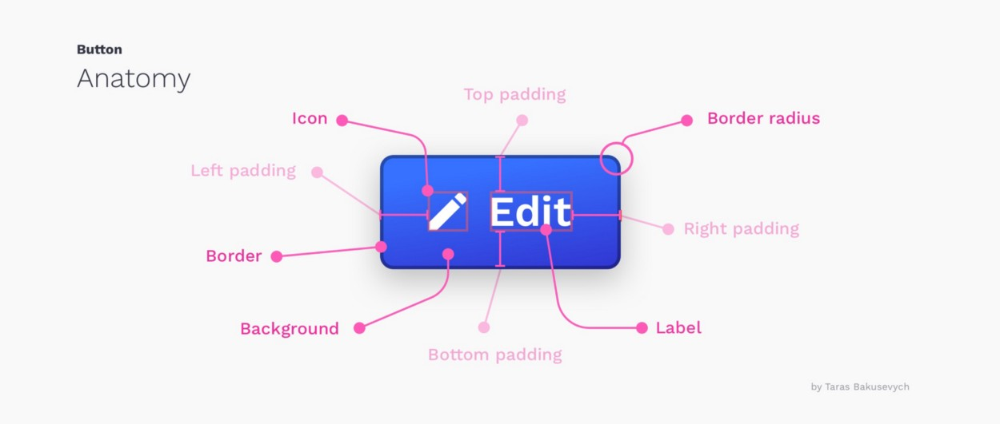


---
--- 
- ## 1.2 Evaluation of guidelines
---
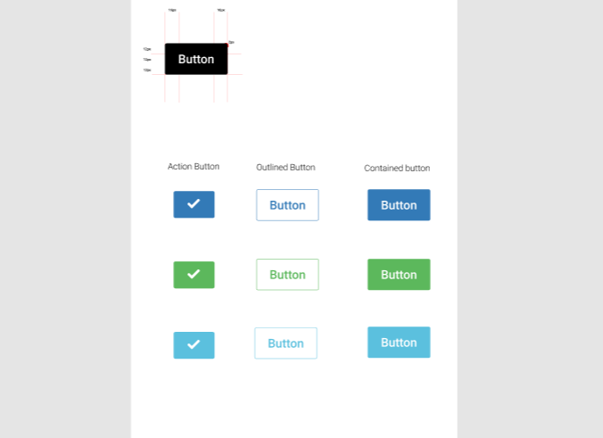

### Colors
The colour palette chosen to these buttons is base on Bootstrap Colors.

-  `#337AB7`

-  `#5CB85C`

-  `#5BC0DE`


### Button Guidelines


The buttons were developed following Material design Guidelines.

Google maintains material Design and keeps extensive documentation explaining how to use and implement it. 
This kind of support and documentation can be a problem solve form many modern design systems.

The first Button Design uses the Contained buttons guidelines, a type that offers a high emphasis, distinguished by elevation and fill.

The second button is based on the Outlined button (known sometimes as "Ghost button") are a step up in difficulty and focus from a text button. Normally this kind of buttons is used as an action button not primary. 
To the good use, it is suggest using a fill when hover to give the feeling of selection to the user.

The Third Button Design was created using Icon buttons Guidelines. They are commonly found in app bars and toolbars.

---
---
- ## 1.3 Planning & design prototyping
---
To store all current buttons, it was created three variants, allowing to create multiple buttons with different colours just using the original.

 The Container button has the particularly that when the cursor is Hover, it will expand.

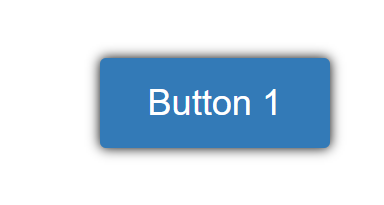

 The Outlined button changes the background colour when it is hovered.

  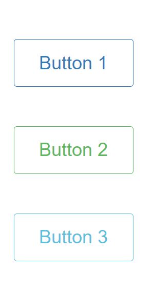
 
 The Icon button doesn't have interaction.

 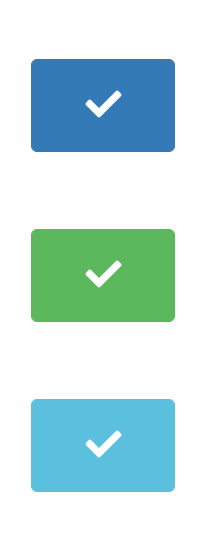


## You can access the Button Figma file  [HERE](https://www.figma.com/file/liWJrdA84HTJsg2bLtxf1G/COM525-WEEK3?node-id=4%3A0)


---
---
- ## 1.4 Coding
---
```import React from "react";
import styled from "styled-components";
import { FontAwesomeIcon } from "@fortawesome/react-fontawesome";
import { faCheck, faPlus } from "@fortawesome/free-solid-svg-icons";
import BackMenu from "../../Assets/home.svg";


import { BrowserRouter as Router, Switch, Route, Link } from "react-router-dom";

const StyledWrapper = styled.div`
  width: 100vw;
  margin-left: 0vw;
  display: flex;
  flex-direction: row;
  align-items: center;
  justify-content: center;
  flex-wrap: wrap;
`;

const StyledButton = styled.button`
  color: #fff;
  background-color: ${(props) => props.color};
  padding: 1rem 2rem;
  font-size: 1.5rem;
  border: 0;
  border-radius: 0.25rem;
  box-shadow: 0 0 0.5rem rgba(0, 0, 0.3);
  cursor: pointer;
  margin: 2%;

  &:hover {
    padding: 1rem 3rem;

    transition: 0.5s all ease-out;
  }
`;

const StyledBorderButton = styled.button`
  color: ${(props) => props.color};
  background-color: transparent;
  padding: 1rem 2rem;
  font-size: 1.5rem;
  border: 1px solid ${(props) => props.color};
  border-radius: 0.25rem;
  cursor: pointer;
  margin: 2%;

  &:hover {
    color: #fff;
    background-color: ${(props) => props.color};
    transition: 0.2s all ease-out;
  }
`;

const CheckedBorderButton = styled.button`
  color: white;
  background-color: ${(props) => props.color};
  padding: 1rem 2rem;
  font-size: 1.5rem;
  border: 1px solid ${(props) => props.color};
  border-radius: 0.25rem;
  cursor: pointer;
  margin: 2%;

  &:hover {
    fontawesomeicon-color: white;
    color: #fff;
    background-color: ${(props) => props.color};
    transition: 0.2s all ease-out;
  }

  fa&hover {
    color: white;
  }
`;

const Breaker = styled.div`
  flex-basis: 100%;
  display: flex;
  flex-direction: row;
  align-items: center;
  justify-content: center;
  margin-left: 0vw;
`;

export const Button = (props) => {
  const { children, color } = props;

  return <StyledButton color={color}>{children}</StyledButton>;
};

export const BorderButton = (props) => {
  const { children, color } = props;

  return <StyledBorderButton color={color}>{children}</StyledBorderButton>;
};


const Week3 = () => {
  return (
    <div>
      <a href="/interaction-design/" style={{textDecoration:"none",color:"black"}}>
                
            </a>
    <StyledWrapper>
       


      <Breaker>
        <Button color="#337ab7">Button 1</Button>
        <BorderButton color="#337ab7">Button 1</BorderButton>
        <CheckedBorderButton color="#337ab7">
          <FontAwesomeIcon
            icon={faCheck}
            style={{ color: "white" }}
            fixedWidth
          />
        </CheckedBorderButton>
      </Breaker>

      <Breaker>
        <Button color="#5cb85c">Button 2</Button>
        <BorderButton color="#5cb85c">Button 2</BorderButton>
        <CheckedBorderButton color="#5cb85c">
          <FontAwesomeIcon
            icon={faCheck}
            style={{ color: "white" }}
            fixedWidth
          />
        </CheckedBorderButton>
      </Breaker>

      <Breaker>
        <Button color="#5bc0de">Button 3</Button>
        <BorderButton color="#5bc0de">Button 3</BorderButton>
        <CheckedBorderButton color="#5bc0de">
          <FontAwesomeIcon
            icon={faCheck}
            style={{ color: "white" }}
            fixedWidth
          />
        </CheckedBorderButton>
      </Breaker>
    </StyledWrapper>
    </div>
  );
};

export default Week3;
```


---
---
- ## 1.5 ScreenCast
---
 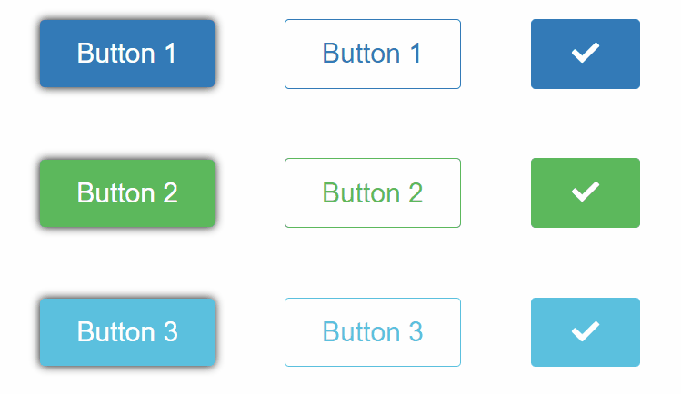

---
---
- ## 1.6 reflection
---
The button is intended to guide users to take the action you want them to take. This component allowed knowing several styles, pros and cons, and the best circumstance to be implemented. The UX button style is always about identification and transparency. Think about the web or software as a chat that began with a busy person. The button plays a vital role in this discussion.

---
---

# 2. Menus
---
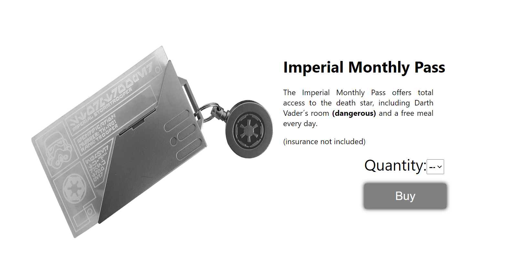

---
---
- ## 2.1 Research
---
A dropdown menu is a design pattern that helps to view a list of content, navigation points, and functions without simultaneously overwhelming the user with several choices. When users press the menu label, they find a list of favourites and choose one of these options by clicking on the right content tag.

The idea of monthly pass comes with one of the options to illustrate different ways to use menus.

(Li A, 2017) states that "Dropdowns clearly have their place in effective web design" so the proper use of them will allow for a good User Experience.

The Star Wars theme was a personal choice for Design's development. This theme will appear on other Components.

---
---
- ## 2.2 Evaluation of guidelines
---

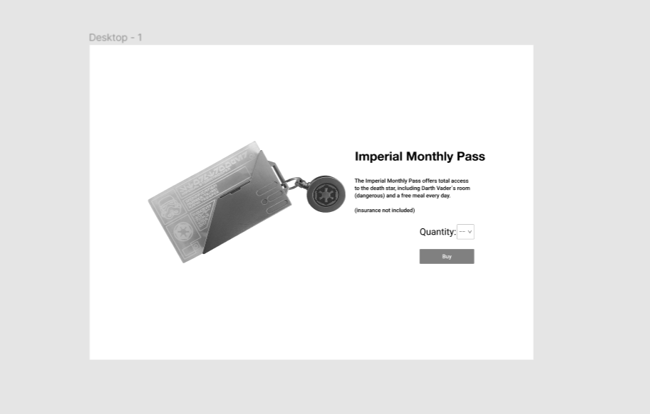


This component adopted the concept of aligning content to the middle following the [Left and Right Horizontal Alignment](https://uxengineer.com/principles-of-design/alignment/), the easiest way to ensure this to happen is to establish a max-width for all the content in the beginning. The invisible box will ensure that the elements are aligned.

The Proximity principle states that we have two ways to perceive elements, the first is when the elements are to close we see that as a unit and when they are far away from each other giving the idea of separate or different.

The Alignment principle states that no element should be placed without logic and clear thought.

So this component will follow the Proximity and Alignment principle to ensure a clear and logical interaction.

the color palette used on this component:

-  `#808080`


---
- ## 2.3 Planning & design prototyping

Creating a layout and dividing them into two sections, one for the image and the other for the content, according to the principles refer int the section above, and place the elements in the middle.

## You can access the Menu Figma file  [HERE](https://www.figma.com/file/GwDlns968VCYsbsj868qAw/COM525-WEEK6)


---
---
- ## 2.4 Coding
---
```
import React from "react";
import ReactTimeout from 'react-timeout';
import styled from "styled-components";
import { withSwalInstance } from 'sweetalert2-react';
import swal from 'sweetalert2';
import BackMenu from "../../Assets/home.svg";

import pass from "../../Assets/pass.jpg"
 
const SweetAlert = withSwalInstance(swal);

function refreshPage() {
  window.location.reload(false);
}


const StyledDivRow = styled.div`
flex:50%;
padding:10px;
height:300px;

`;

const StyledWrapper = styled.div`
width: 100vw;
height: 70vh;
display: flex;
justify-content: center;
align-items: center;

`;


const StyledButton =styled.button`
    padding: 0.5em 4rem;
    font-size: 1.5rem;
    background-color: grey;
    color: white;
    border: 0;
    border-radius: 0.25rem;
    box-shadow: 0 0 0.5rem rgba(0,0,0.3);
    cursor: pointer;
    margin: 3%;
    margin-left: 27%;
}

`;

const options = [
  {
    label: "--",
    value: 0,
  },
  {
    label: "1",
    value: 1,
  },
  {
    label: "2",
    value: 2,
  },
  {
    label: "3",
    value: 3,
  },
  {
    label: "4",
    value: 4,
  },
  {
    label: "5",
    value: 5,
  },
];
function sayHello() {
  alert("Thank you for your purchase, your card has been updated.The page will refresh");
}

function ss(){
  setTimeout(5000);
  window.location.reload();
}

const styles = styled.image`

width: 135px;
height: 135px;

`;


class Week6 extends React.Component {
  constructor(props) {
    super(props);
    this.state = {
      default: "",
    };

    this.handleChange = this.handleChange.bind(this);
  }

  handleChange(e) {
    console.log("Fruit Selected!!");
    this.setState({ default: e.target.value });
  }
 
  
  render() {
    return (
      <div>
      <a href="/interaction-design/" style={{textDecoration:"none",color:"black"}}>
                
            </a>
      <StyledWrapper>

<StyledDivRow>


</StyledDivRow>

<StyledDivRow >


      <h1>Imperial Monthly Pass</h1>
      <p/>
      <p style={{width:"50%",textAlign: "justify"}}>The Imperial Monthly Pass offers total access to the death star, including Darth Vader´s room <b>(dangerous)</b> and a free meal every day.</p>
      <p>(insurance not included)</p>
        <div className="select-container" style={{fontSize:"xx-large", marginLeft:"27%"}}>
            Quantity: 
            <select value={this.state.default} onChange={this.handleChange} style={{width: "8%",fontSize: "x-large"}}>
            {options.map((option) => (
              <option value={option.value}>{option.label}</option>
            ))}
          </select>
          </div> 
    
      <StyledButton  onClick={() => {
          sayHello();
          ss();
        }}>
        Buy
    </StyledButton>
    </StyledDivRow>
 
      </StyledWrapper>
      </div>

    );

  }
}

export default Week6;


```


---
---
- ## 2.5 ScreenCast
---
 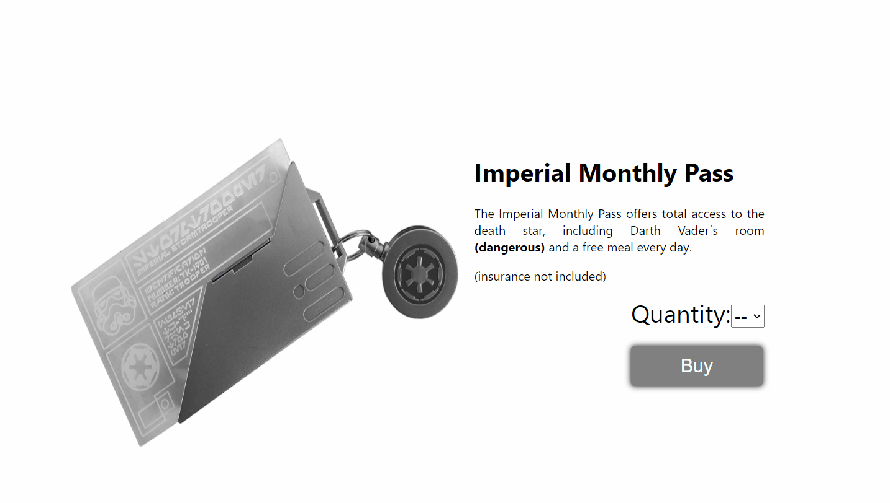


---
---
- ## 2.6 Reflection
---
The drop-down menu was a brilliant breakthrough in architecture. It improved the way people navigated through web sites, making it much faster. This component allowed knowing several styles, pros and cons, and the best circumstance to be implemented. And having the opportunity to study a few design principles of organising the content and their influence at the user's eyes.

---   
---
# 3. Forms 
---
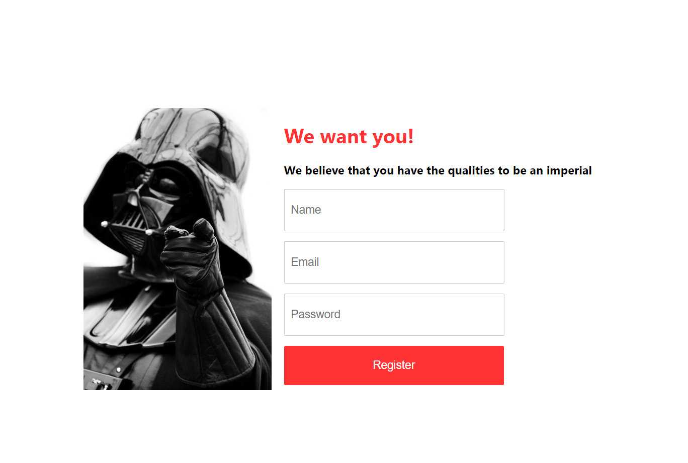

---
---
- ## 3.1 Research
---
 (Hayley Sacket,2019) states that "26% of people abandoned their purchase during checkout due to a long or complex process".

The form design is important because they will impact the overall user if it's not clear and gets the user frustrated, so there is a high risk of leaving the site. This form is designed to be more simple that can be giving a positive experience to the customer and arranges the content in one column make it easier for the user to fill in as we naturally read top to bottom.


When the user clicks on the Register Form, it will show a message that follows the centered horizontal alignment because this method normally is used when there is a single element in a row.

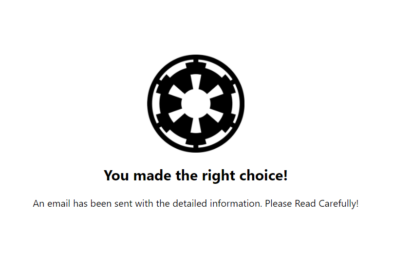


---
---
- ## 3.2 Evaluation of guidelines
---
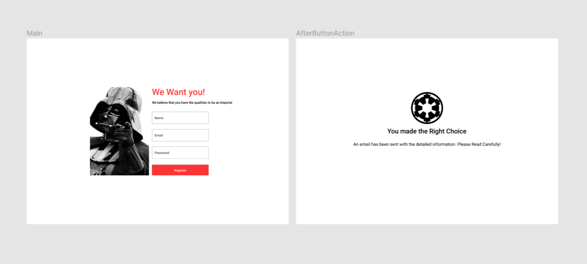

The form fields was created following the Material Design Principles giving a clear and a efficient layout.

Register Form contains 3 input fields that 2 are text type fields, and one is a password type field. When the user clicks on an input field, it will change the border color to ensure which components are select. Error messages will appear when the user clicks on the register button and missing information or invalid. 


The Darth Vader image used on the component is inspired by Lord Kitchener "your country needs you" ([Image](https://api.time.com/wp-content/uploads/2017/04/kitchener.jpeg)) and the Uncle Sam's "I want you" ([Image](https://i.kym-cdn.com/entries/icons/facebook/000/002/872/i-want-you-giwy.jpg)).

 It looks that Darth Vader is giving an idea of recruitment. 

---
---
- ## 3.3 Planning & design prototyping
---
Planning the layout and how the input fields should be displayed and the information on the next page when the user clicks on the register button.

The colour Pallete used on this component:

-  `#ff3333` (Button)

-  `#A32121` (Button Active)

## You can access the Form Figma file  [HERE](https://www.figma.com/file/EHO19E6ty8wzK1uFtMUu8q/COM525-WEEK7)

---
---
- ## 3.4 Coding
---
```
import React, { useState,Component } from "react";
import styled from "styled-components";
import DatePicker from 'react-date-picker';
import wEWantYou from "../../Assets/WeWantYou.png";
import logo from "../../Assets/imperial_logo.png";
import BackMenu from "../../Assets/home.svg";


import { useForm } from "react-hook-form";
import { yupResolver } from "@hookform/resolvers/yup";
import * as yup from "yup";

const schema = yup.object().shape({
  email: yup.string().required("Email is required").email("Not a valid email"),
  password: yup.string().required("Password is required"),
  name:yup.string().required("Name is required"),
});

const StyledDivRow = styled.div`
flex:50%;
padding:10px;
height:300px;

`;

const StyledWrapper = styled.div`
width: 100vw;
height: 70vh;
display: flex;
justify-content: center;
align-items: center;


`;


const StyledHeader = styled.h1`
  color: #ff3333;
`;

const StyledInput = styled.input`
  background: #ffffff;
  border: 1px solid #c7c7c7;
  height: 63px;
  width: 337px;
  padding-left: 10px;
  font-size: 18px;
`;

const StyledIcon = styled.img`
  width: 24px;
  height: 24px;
  margin-left: -80px;
  margin-bottom: -10px;
`;

const StyledErrorText = styled.p`
  color: red;
`;

const StyledButton = styled.button`
  height: 63px;
  width: 350px;
  background: #FF3333;
  color: #ffff;
  text-align: center;
  font-size: 18px;
  border: 0;
  cursor: pointer;
  &:hover {
    background: #A32121;
  }
`;

const StyledImage = styled.img`
;


`;

const Week7 = () => {

  
  const [value, onChange] = useState(new Date());
  const [showPassword, setShowPassword] = useState(false);
  const [submitted, setSubmitted] = useState(false);

  const { register, handleSubmit, watch, errors } = useForm({
    resolver: yupResolver(schema),
  });
  const onSubmit = (data) => {
    setSubmitted(true);
    console.log(data);
  }

  const handleClick = (e) => {
    setShowPassword(!showPassword);
  };

  return (
      <div>
          <a href="/interaction-design/" style={{textDecoration:"none",color:"black"}}>
                
            </a>

      <StyledWrapper>


      {submitted &&
            
          <div>
            
            <p/>
            <h2 style={{textAlign:"center"}}>You made the right choice!</h2>
          
          <p>  An email has been sent with the detailed information. Please Read Carefully!</p>
          </div>

      }

      
     

      {!submitted && (
      
        <StyledWrapper>
           <StyledDivRow>

          

          </StyledDivRow>


      <StyledDivRow>

      <StyledHeader> We want you!</StyledHeader>

      <h3>We believe that you have the qualities to be an imperial</h3>

      <form onSubmit={handleSubmit(onSubmit)}>
      <p>
          <StyledInput
            type="text"
            name="name"
            placeholder="Name"
            ref={register()}
          />
        </p>
        <StyledErrorText> {errors.name?.message}</StyledErrorText>
        <p>
          <StyledInput
            type="text"
            name="email"
            placeholder="Email"
            ref={register()}
          />
        </p>
        <StyledErrorText> {errors.email?.message}</StyledErrorText>
        <p>
          <StyledInput
            type={showPassword ? "text" : "password"}
            name="password"
            placeholder="Password"
            ref={register()}
          />
          <StyledErrorText> {errors.password?.message}</StyledErrorText>
        </p>
        <p>
          <StyledButton> Register </StyledButton>
        </p>
      </form>
      </StyledDivRow>
      </StyledWrapper>

      )}

      </StyledWrapper>
      </div>

      );
};

export default Week7;

```

---
---
- ## 3.5 ScreenCast
---
 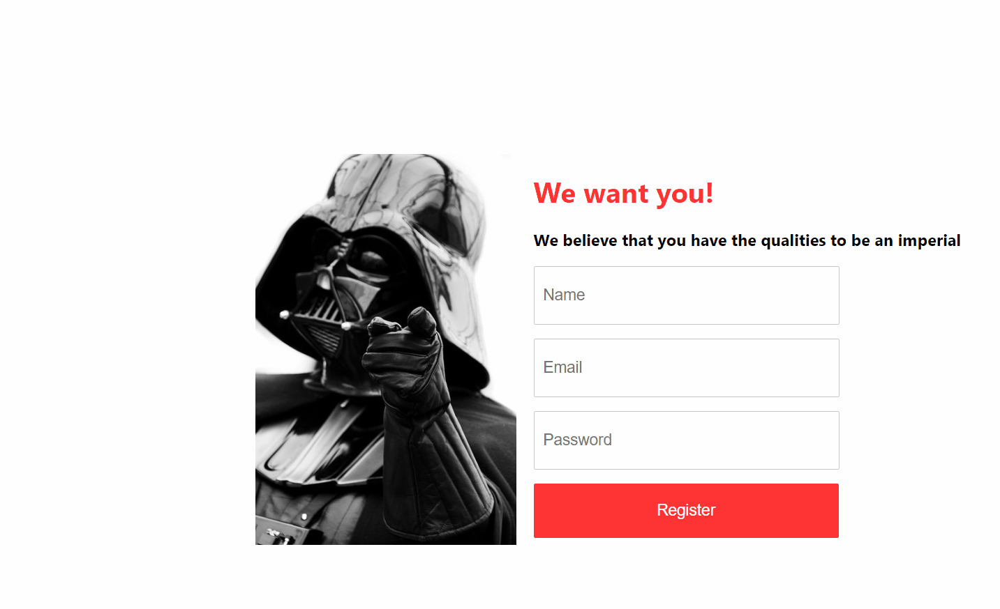


---
---
- ## 3.6 Reflection
---
While many Designer thinks that Forms might be tedious, or they might be neglected or ignored. I believe that it does come with ample margin for creativity and innovation. Forms may be the most critical aspect of a company website. This component allowed knowing the pros and cons, and the best circumstance to be implemented. 

---
---
# 4.Modal
---
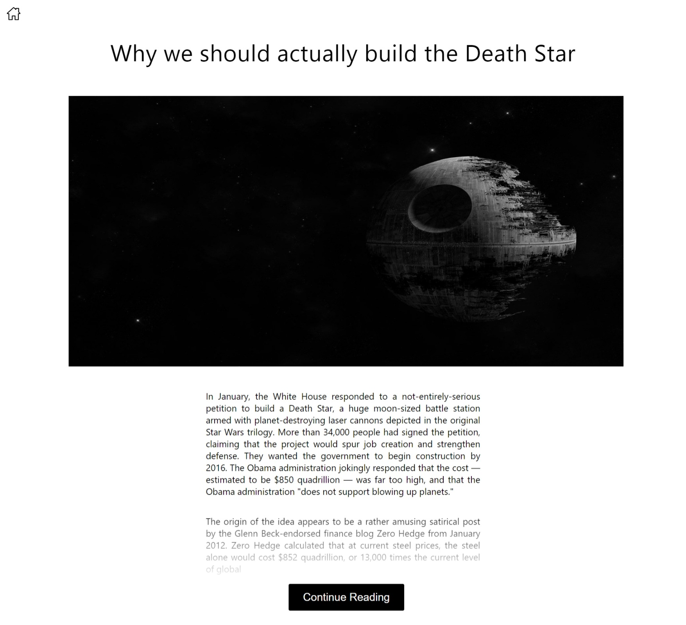

---
---
- ## 4.1 Research
---
Modals are an effective feature of the user experience when the plan and use them correctly. They will help consumers achieve their goals more effectively and easily. But dialogues, when they are done incorrectly, will frustrate them. Knowing how to code dialogues would make it easier to use them in a manner that does not upset the customers.

For this component it was used a modal window, this modal appears when the user clicks on the "Continue reading" button, suggesting if the user wants to read the full article he will need to put his email.

A modal window is an element that appears in front of the main page it creates a mode that disables the main window as a primary window with the modal window but keeps it visible in front of it. Users have to connect with the modal window before they can return to the parent program.


---
---
- ## 4.2 Evaluation of guidelines
---

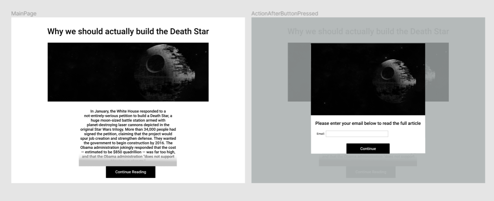

The modal follows the [w3schools](https://www.w3schools.com/howto/tryit.asp?filename=tryhow_css_modal) guidelines trying to be as simples as can be. After clicking on the button to interrupt the user’s current task, the modal will appear to catch his full attention to something more important and ask for information if the user wants to continue reading the article. 


The [UXplanet](https://uxplanet.org/best-practices-for-modals-overlays-dialog-windows-c00c66cddd8c) shows a good example of the anatomy of a Modal Window, explaining what and where the elements should be implemented.

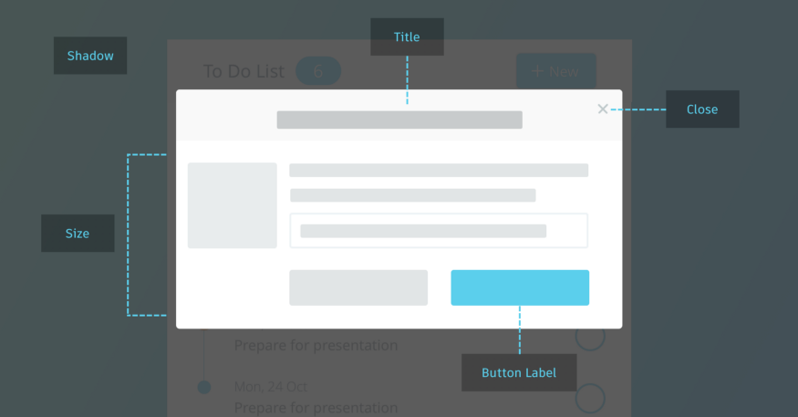

The color pallete used on this component:
-  `#000000` (Button)


---
---
- ## 4.3 Planning & design prototyping
---
During the Planning, I have founded that the modal would prompt a message to the user that if he wants to continue, he needs to insert his email using black transparency to focus on the modal. Its possibility of exit the modal without entering the email is possible, but he content will be limited.

The function of showing the rest of the article is not implemented yet, but it will in a future version.

## You can access the Modal Figma file  [HERE](https://www.figma.com/file/XyOQKHAXG7YxfcYiGcXkjn/COM525-WEEK8)


---
---
- ## 4.4 Coding
```
import React, {useState} from "react";
import styled, {keyframes} from "styled-components";
import coverIMG from "../../Assets/death.jpg";
import close from "../../Assets/close.svg";
import BackMenu from "../../Assets/home.svg";


const StyledModalWrapper = styled.div `
   
    position: fixed;
    width: 100vw;
    height: 100vh;
    top: 0;
    z-index: 999;
    background: rgb(169,169,169,0.9);
    display: flex;
    justify-content: center;
    align-items: center;
`;

const StyledModal = styled.div `
    position: fixed;
    z-index:1000    ;
    width: 50vw;
    height: 90vh;
    background-color: white; 
`;

const StyledTitle = styled.h1 `

text-align:center;
margin-top:1rem;
margin-bottom:4rem;
font-family: -webkit-pictograph;
font-size:51px;
`;

const StyledModalHeader = styled.header `
    display: flex;
    justify-content: flex-end;
    padding: 0.5rem 0.5rem;
    font-size: 30px;
    cursor: pointer;
    background:black;
`;
const StyledContent = styled.p `
    width:40%;    
    display: block;
    margin-block-start: 1em;
    margin-block-end: 1em;
    margin-inline-start: 0px;
    margin-inline-end: 0px;
    font-size:20px;
    position: relative;
    margin:0 auto;
    text-align: justify;
    margin-top:3rem;
}
`;
const CheckedBorderButton = styled.button `
  color: white;
text-align:center;
margin-left:30%;
background-color:black;
};
  padding: 1rem 2rem;
  font-size: 1.5rem;
  border: 1px solid ${
    (props) => props.color
};
  border-radius: 0.25rem;
  cursor: pointer;
margin-bottom:2rem;
  &:hover {
    fontawesomeicon-color: white;
    color: #fff;
    background-color: ${
    (props) => props.color
};
    transition: 0.2s all ease-out;
  }

  fa&hover {
    color: white;
  }
`;

const ModalImage = styled.img `

margin-top:0;
height:55%;
width:100%;


`;
const StyledInput = styled.input `
background: #ffffff;
margin-Left:16px;
margin-bottom:2rem;

border: 1px solid #c7c7c7;
height:3rem;
width:328px;
margin-top:0.5rem;
font-size:16px;
font:Roboto;
font-color: #000000 60%;
padding-left:1rem;
`;
const ModalButton = styled.button `
color: white;
background-color:black;
padding: 0.5rem 4rem;
font-size: 1.5rem;
border: 1px solid black;
verticalAlign:"middle"
border-radius: 0.25rem;
cursor: pointer;
margin-bottom:2rem;
margin: 0 auto;
display:flex;
`;

const StyledFadeOut = styled.div `
background-image: linear-gradient(#000000 0%,rgba(0,0,0,0));
-webkit-background-clip: text;
-webkit-text-fill-color: transparent;
position:relative;
display:inline-block;
`;


const Modal = (props) => { // show={showModal} onClose={handleClose}

    const {show, onClose, children} = props;

    const blockClick = (e) => {
        e.preventDefault();
        e.stopPropagation();
    }

    return (
        <div>
      <a href="/interaction-design/" style={{textDecoration:"none",color:"black"}}>
                
            </a>
        <> {
            show && (
                <StyledModalWrapper onClick={onClose}>
                    <StyledModal onClick={blockClick}>
                        <StyledModalHeader>
                            </img>
                        </StyledModalHeader>
                        {children} </StyledModal>
                </StyledModalWrapper>
            )
        } </>
        </div>
    )
}
const Week8 = () => {

    const [showModal, setShowModal] = useState(false);
    const handleClose = () => setShowModal(false);
    const handleClick = () => setShowModal(true);

    return <>
    
        <Modal show={showModal}
            onClose={handleClose}>


            <ModalImage src={coverIMG}></ModalImage>
            <h2 style={
                {
                    fontFamily: "sans-serif",
                    marginLeft: "1rem"
                }
            }>Please enter your email below to read the full article</h2>

            <span style={
                {
                    fontSize: "20px",
                    marginLeft: "1rem"
                }
            }>Email:</span>

            <StyledInput type="text" name="Email"/>

            <ModalButton onClick={handleClose}>
                Continue
            </ModalButton>
        </Modal>

        <StyledTitle>Why we should actually build the Death Star</StyledTitle>

        </img>
        <StyledContent>
            <p>
                In January, the White House responded to a not-entirely-serious petition to build a Death Star,
 a huge moon-sized battle station armed with planet-destroying laser cannons depicted in the original Star Wars trilogy. 
 More than 34,000 people had signed the petition, claiming that the project would spur job creation and strengthen defense.
 They wanted the government to begin construction by 2016. The Obama administration jokingly responded that the cost 
 — estimated to be $850 quadrillion — was far too high, and that the Obama administration "does not support blowing up planets."
            </p>
            <StyledFadeOut>

                <p>
                    The origin of the idea appears to be a rather amusing satirical post by the Glenn Beck-endorsed finance blog Zero Hedge from January 2012.
             Zero Hedge calculated that at current steel prices, the steel alone would cost $852 quadrillion, or 13,000 times the current level of global
                </p>
            </StyledFadeOut>


            <CheckedBorderButton onClick={handleClick}>
                Continue Reading
            </CheckedBorderButton>

        </StyledContent>


    </>
}


export default Week8;

```

---
---
- ## 4.5 ScreenCast

---

---
---
- ## 4.6 Reflection
---
When used correctly, modals can allow users to perform actions without losing context or changing pages quickly. The programmer needs to be always alert of how the modal is implemented, and make sure that is not poorly done because this action can create confusion for the user and make him exit the page.

Getting the user’s attention is always essential, and the programmer can achieve this by keeping the context and simplifying the UI are tremendous benefits of modals.


---
---
# 5. Toggle Switch
---
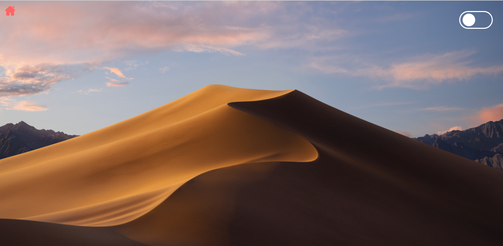

---
---
- ## 5.1 Research
---
A UI control with two mutually exclusive states, such as ON and OFF, is a Toggle switch. This control's architecture and operation are based on a physical switch that allows users to ON or OFF items (i.e. light switch). Although there have been toggle switches in user interfaces for a while, many programmers still abuse them.

In this component, the toggle switch's function will be switching between day mode and night mode and changing the wallpaper.

It is a big win for customer experience to provide the users with a way to adapt the app to their liking. Providing the user with a quick toggle switch between dark and light modes here.


---
---
- ## 5.2 Evaluation of guidelines
---
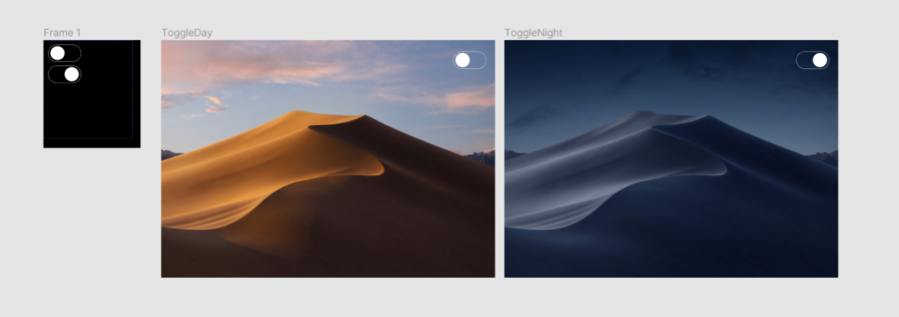

This component was initially designed for IOS, but it was adapted to the desktop version.

The Toggle Switch was created following the [Material Design](https://material-ui.com/components/switches/) Principles giving a clear and efficient layout.

Colour is an important visual symbol for toggles, and there are two things to bear in mind: contrast and cultural distinctions. If artists use low-contrast shades, consumers can't know whether or not a toggle is on or off. Therefore, always using a high-contrast colour to adjust the signal's status. In this component was used only the white colour.

When the Toggle Switch is active, it shows a smooth transition following with the image transition.

---
---
- ## 5.3 Planning & design prototyping
---

The Design started with the development of the toggle switch

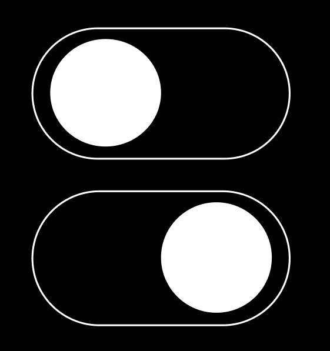 

After creating the toggle switch it was created the dynamic background This background is known on Macs but, in this component it will create a smooth trasition between the two modes and giving a pleasure interaction to the user. 

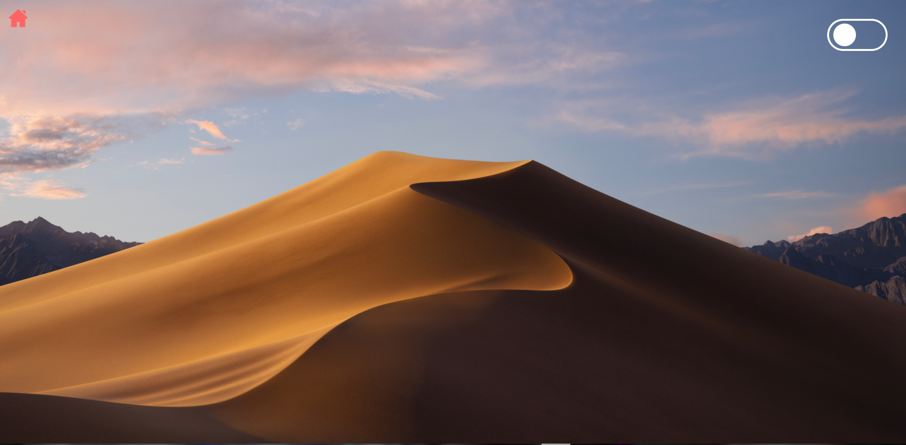 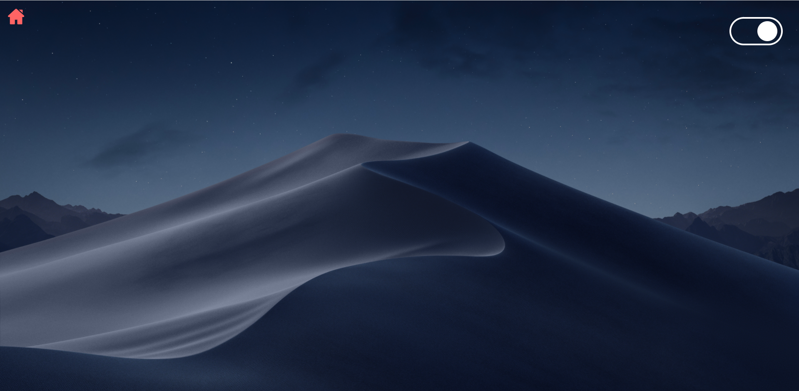 


## You can access the Switch Figma file  [HERE](https://www.figma.com/file/H9he6E1xrF1prl17XHnQtd/COM525-WEEK9?node-id=0%3A1)


---
---
- ## 5.4 Coding
---

```
import React, { useState, useEffect } from 'react';
import styled, { keyframes } from 'styled-components';

import day from "../../Assets/day.jpg";
import night from "../../Assets/night.jpg";
import BackMenu from "../../Assets/home-color.svg";

const time = '0.25s';

const setAnimation = (from, to) => keyframes({ from: from, to: to })


const StyledWrapper = styled.div`
animation: ${time} ${({ showBackground }) => (showBackground && setAnimation({backgroundImage: 'url('+day+')',backgroundSize:"Cover",height: "100vh",transition: "0.2s all ease-out", color: '#000'}, {backgroundImage: 'url('+night+')',backgroundSize:"Cover",height: "100vh",transition: "0.2s all ease-out", color: '#000   '})) || (!showBackground && setAnimation({backgroundImage: 'url('+night+')',backgroundSize:"Cover",height: "100vh",transition: "0.2s all ease-out"}, {backgroundImage: 'url('+day+')',backgroundSize:"Cover",height: "100vh"}))} linear;
animation-fill-mode: forwards;
    display: block;
    height: 100vh;
    width: 100vw;
    justify-content: center;
    transition: 0.25s all ease-out;
    align-items: center;
`;

const StyledButton = styled.div`
    animation: ${time} ${({ active }) => (active && setAnimation({backgroundColor: '#fafafa', color: '#333'}, {backgroundColor: '#fff', color: '#fff'})) || (!active && setAnimation({backgroundColor: '#333', color: '#fff'}, {backgroundColor: '#313130', color: '#333'}))} linear;

    border-radius: 5rem;
    border: solid 0.2rem;
    background-color: transparent;
    color: #fff;
    height: 3rem;
    width: 6rem;
    float: right;
    margin: 2rem;
`;

const StyledSwitch = styled.div`
    border-radius: 5rem;    
    animation: ${time} ${({ active }) => (active && setAnimation({marginLeft: 0}, {marginLeft: '50px'})) || (!active && setAnimation({marginLeft: '47px'}, {marginLeft: '7px'}))} linear;
    animation-fill-mode: forwards;
    border: solid 0.2rem;
    height: 2rem;
    width: 2rem;
    margin: 0.3rem;
    background: #fff;
    
     
`;


const ContentWrapper = styled.div`
    width: 80%;
    height: 25vh;
    display: flex;
    align-items: center;
    justify-content: center;
    flex-direction: column;
    text-align: center;
    margin-top: 2%;
    margin-left: 10%;
    animation: ${time} ${({ showBackground }) => (showBackground && setAnimation({color: '#333'}, {color: '#fff'})) || (!showBackground && setAnimation({color: '#fff'}, {color: '#333'}))} linear; 
    animation-fill-mode: forwards;
`;


const Toggle = (props) => {
    const [active, setActive] = useState(false);
    const { onActive, onNotActive } = props;

    useEffect(() => {
        if (!active) {
            onNotActive();
            return;
        }

        onActive();


    }, [active])


    const handleClick = () => setActive(!active);

    return (<StyledButton> <StyledSwitch active={active} onClick={handleClick} /> </StyledButton>)
}


const Week9 = () => {
   
    const [showBackground, setShowBackground] = useState(false);
    const handleNotActive = () => setShowBackground(false);
    const handleActive = () => setShowBackground(true);

    
    return (
    
    
    <StyledWrapper showBackground={showBackground}>
        <a href="/interaction-design/" style={{textDecoration:"none",color:"black"}}>
                
            </a>
        <Toggle onNotActive={handleNotActive} onActive={handleActive} />


    </StyledWrapper>)
}


export default Week9;

```
---
- ## 5.5 ScreenCast
---


---
---
- ## 5.6 Reflection
---

Toggles is a strong UI part that rarely fails to offer a pleasant experience. It's simple and intuitive to all, and it succeeds in an important end in allowing the user the power of freedom to configure the system. It is necessary to have the right control in the right place to make it more user-friendly.

Defining a style template following this method has helped me think better about my projects. It helped me to make educated and deliberate decisions.

---
---
# References

LI, A., Dropdowns: Design Guidelines [viewed Jan 2, 2021]. Available from: https://www.nngroup.com/articles/drop-down-menus/

SACKETT, H., 2019. The importance of user-friendly form design. In: Clicky Media™. -06-05T08:30:47+00:00 [viewed Jan 11, 2021]. Available from: https://www.clicky.co.uk/blog/the-importance-of-form-design/


